# APP_GYM

Aplicación iOS para rutinas, entrenamientos y seguimiento de progreso, hecha con **SwiftUI**.

**Repositorio público:** [github.com/joseraulsoriano/repo-swift-free-gym](https://github.com/joseraulsoriano/repo-swift-free-gym)

---

## Capturas de pantalla

Galería generada desde capturas del simulador en la carpeta **`assets/`** (mismo estilo que un README con imágenes centradas en GitHub).

<p align="center">
  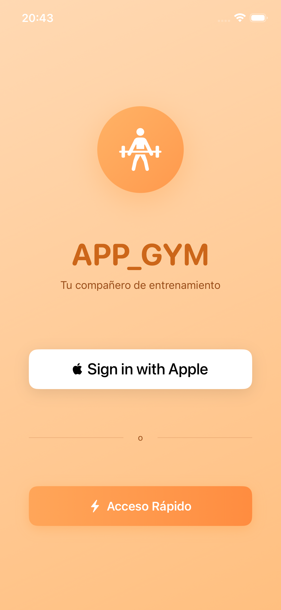
  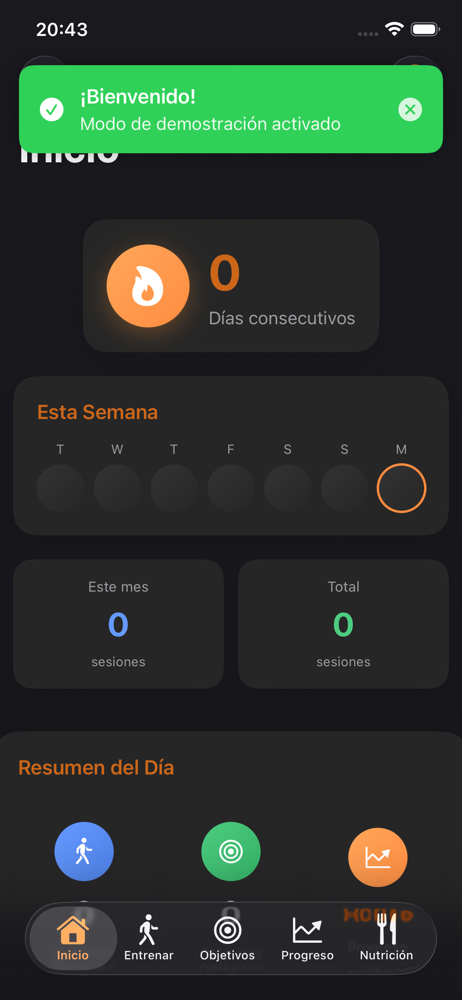
  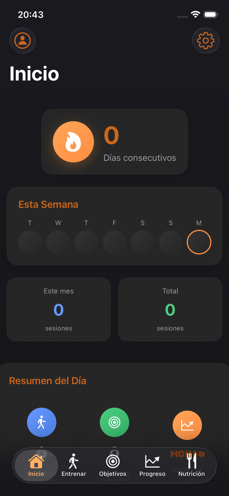
</p>
<p align="center">
  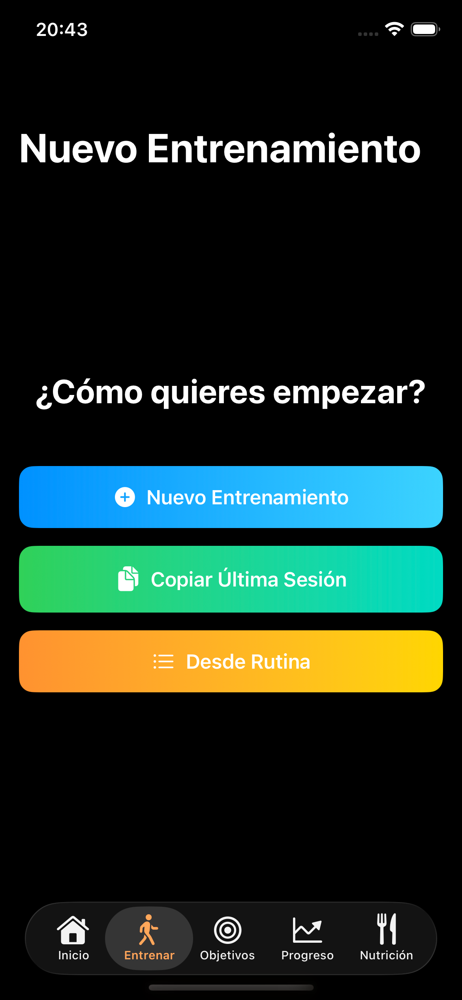
  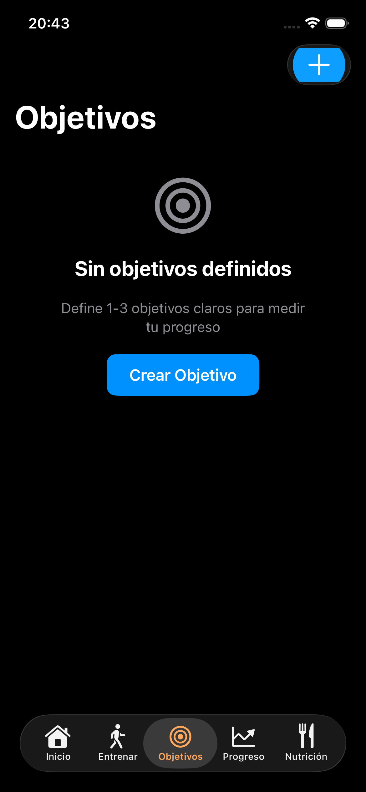
  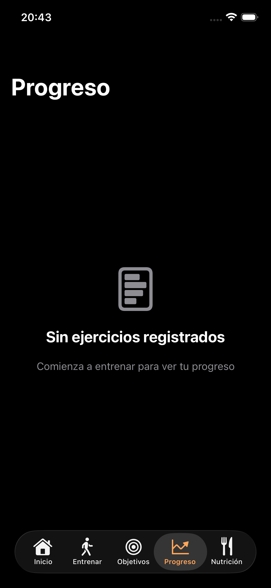
</p>
<p align="center">
  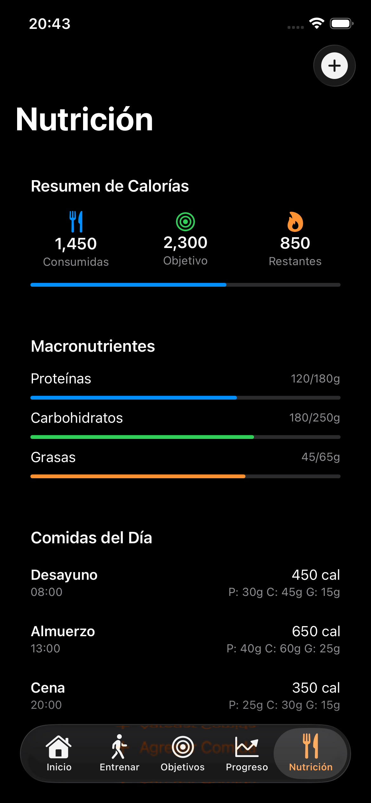
  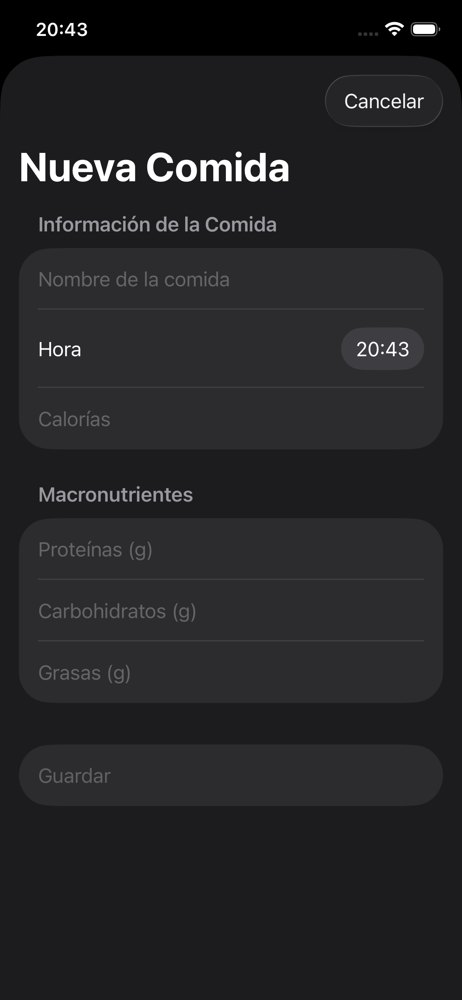
  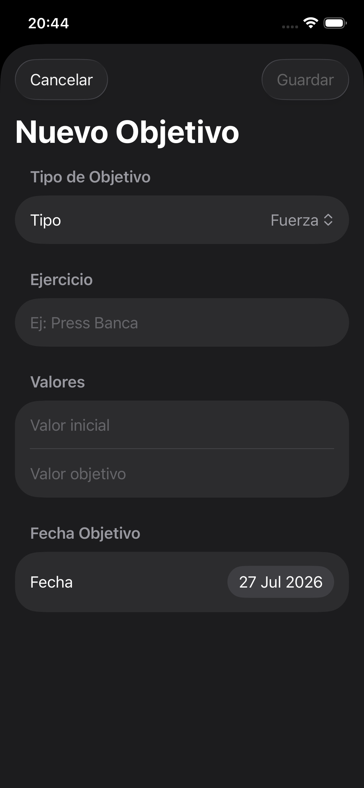
</p>
<p align="center">
  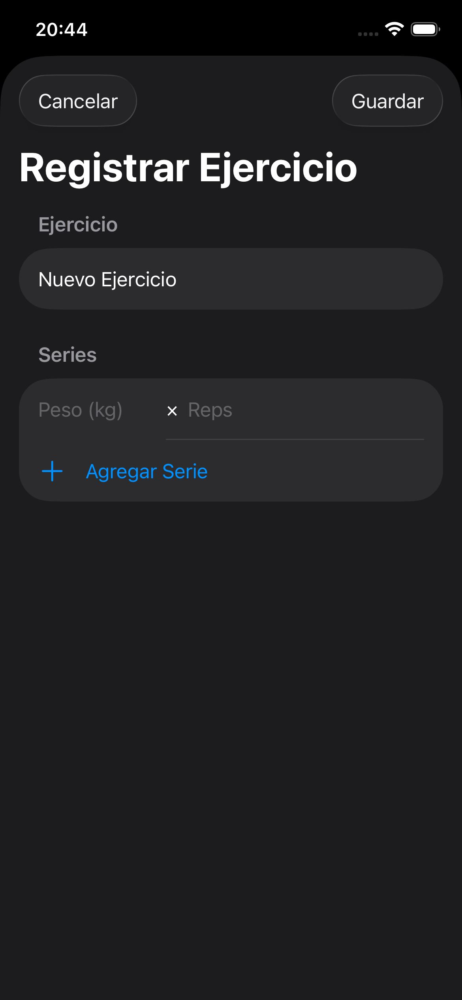
  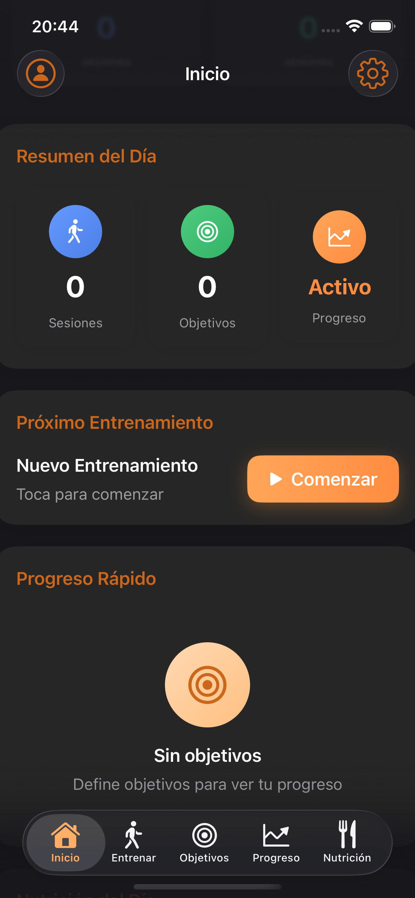
  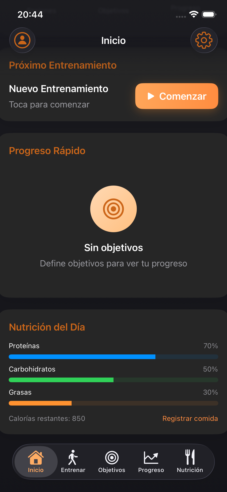
</p>
<p align="center">
  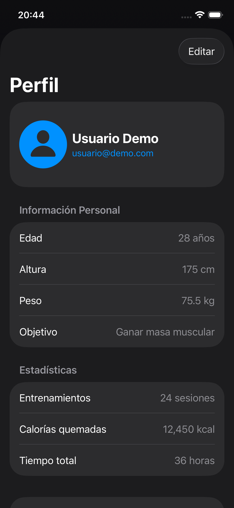
</p>

Para actualizar la galería: sustituye o añade PNG en **`assets/`** y renómbralos como `screenshot-NN.png`, o edita las rutas de arriba. También puedes enlazar imágenes del catálogo Xcode, por ejemplo:

<p align="center">
  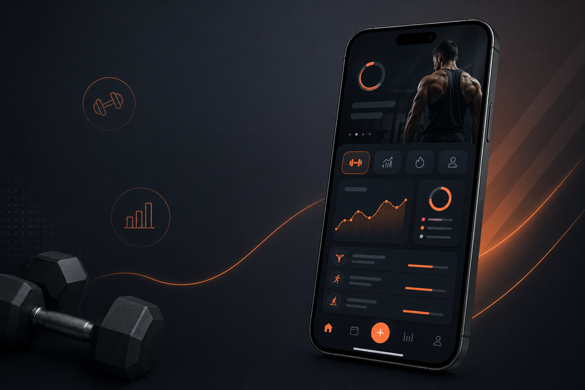
</p>

---

## Descripción

- Sesiones de gimnasio, rutinas, objetivos y métricas corporales  
- Recordatorios y widgets (según el target)  
- Persistencia en **JSON** local y, opcionalmente, **Core Data + CloudKit**

## Requisitos

- iOS 18.0 o superior  
- Xcode 16 o superior recomendado  
- Swift 5  

## Clonar y abrir

```bash
git clone https://github.com/joseraulsoriano/repo-swift-free-gym.git
cd repo-swift-free-gym
open APP_GYM.xcodeproj
```

En **Signing & Capabilities**, asigna tu **Team** y compila en simulador o dispositivo.

## Estructura del proyecto

```
.
├── APP_GYM/                 # Código fuente SwiftUI
│   ├── CoreData/
│   ├── Domain/
│   ├── Views/
│   ├── Widgets/
│   └── Assets.xcassets/
├── assets/                  # Capturas para este README (GitHub)
├── APP_GYMTests/
├── APP_GYMUITests/
└── APP_GYM.xcodeproj
```

## Interfaz

- Navegación por pestañas y vistas modales  
- Modo claro y oscuro  
- SF Symbols  

## Contribución

1. Fork del repositorio  
2. Rama nueva (`git checkout -b feature/nombre`)  
3. Commits claros  
4. Pull request hacia `main`  

## Contacto

**José Raúl Soriano Cazabal** — [X @tu_twitter](https://x.com/tu_twitter)

---

## Solo este proyecto en GitHub

Este directorio tiene **su propio** `.git`. Haz `git add`, `commit` y **`git push` desde esta carpeta** (donde está `APP_GYM.xcodeproj`), no desde el monorepo `STU-BUAP`, para que el remoto del gym **no incluya** STU, LoboBus ni otras carpetas del padre. En el repo `STU-BUAP`, la carpeta `APP_GYM/` está en `.gitignore` para no duplicar historiales.
